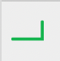
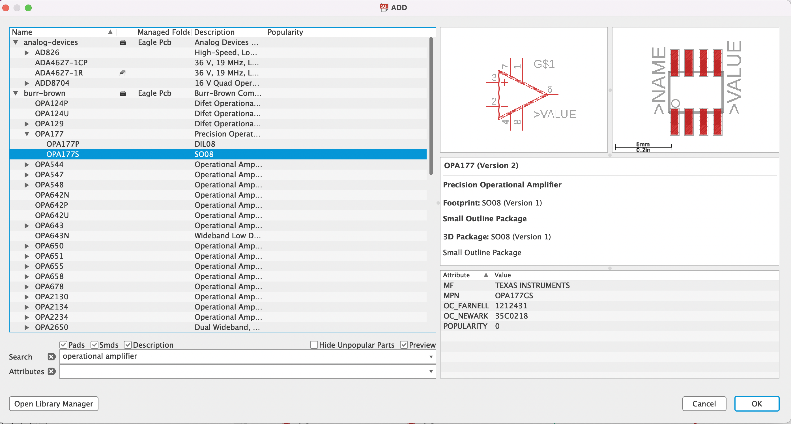
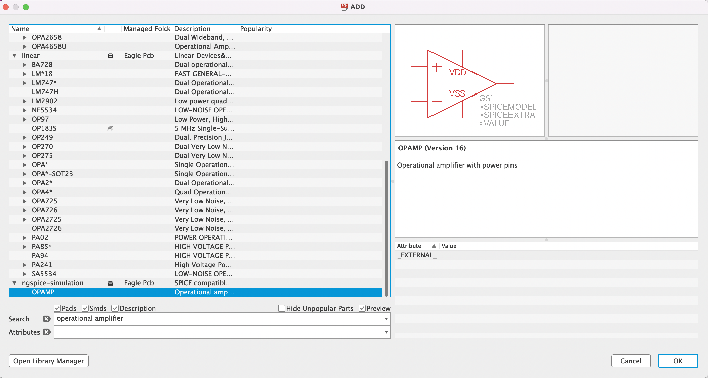

# Voltera-guide
Voltera and Eagle guide for Instrumental Design Final 

The goal of this project is to document the process of using the Voltera V1 PCB printer and drill. This will encoulde a step by step process starting with the initial circuit design and ending with the final PCB. 

### Contents ###
* Eagle
  * Schematic
  * Board
    * Layers
    * Drill Holes
    * Exporting
* Voltera 
  * Drilling 
    * Drill Bit
    * Drill Depth
  * Printing
    * Baking 
    * Rivits 
    * Placing Parts 
  * Soldering 
    * Reflow
  * Other

### Eagel ###
[Install Eagle](https://www.autodesk.com/products/eagle/free-download)
#### Schematic ####
The basic flow of Eagle is to start with a schematic, add all the parts and the connections, and then move to board to set up the final design to send to voltera. Add parts by clicking the add parts icon  this will open a library to search the different possible parts. The search bar is not predicitve so you must search name of the part exactly. You can use an * after letters/words to serch all parts with containing those letters or word. If your part is not included in the basic parts library, there are two options: [import the part to eagle](https://www.snapeda.com), or create a pad of soldering paste on the board to attach the part later. After the part has been downloaded import it to the library by opening the library tab in task bar and clicking update library. Once all the parts are in the schematic, you connect them by the bus icon parts . This tells the board what parts should be connect. Finally when the schematic is complete, it is time to switch to the board mode, by pressing the generate board from schematic icon .

#### Board ####
When the board window opens make sure all parts are present, if they are not go bakc to the schematic and make sure all parts have a footprint when choosing in the library. Below is an example of parts with/without footprint.

    
### Voltera ###
[Install Voltera](https://support.voltera.io/desktop-application)
#### Drilling ####
#### Printing ####
#### Soldering ####
#### Other ####

